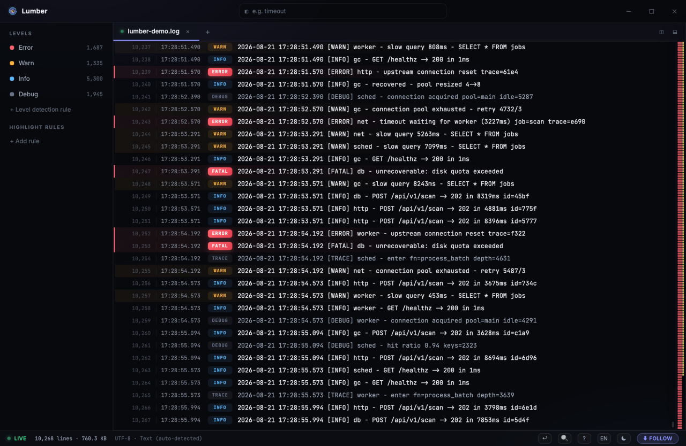
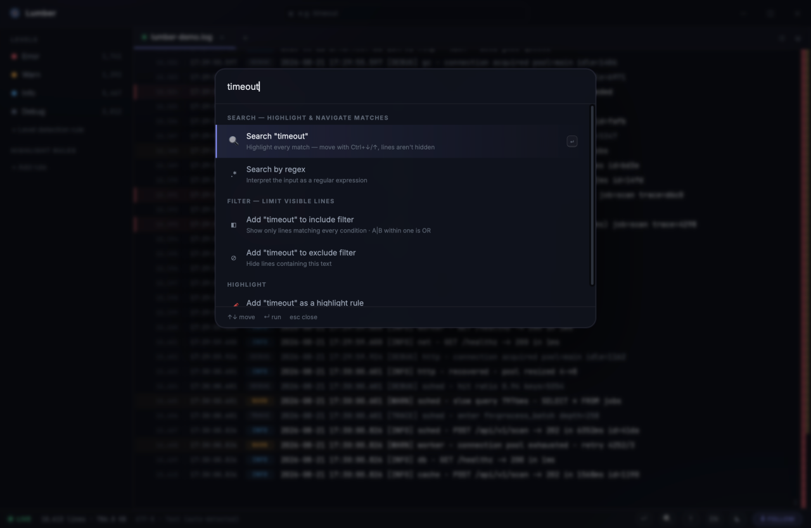
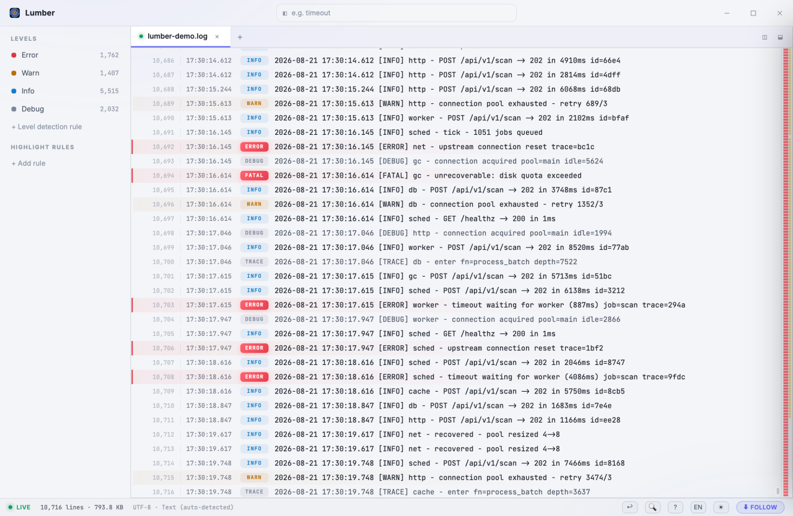

<div align="center">


# Lumber

**A modern, good-looking desktop log viewer.**

Tail logs live, search and filter without losing your place, and actually enjoy reading them.

[](LICENSE)




</div>

> Raw **logs** are just timber. Lumber planes them into something you can build with.

Lumber is a desktop log viewer that tries to be genuinely pleasant to use: a clean, modern interface with the conveniences that make reading logs less tedious — live tail, search with highlighting, non-destructive filters, a command palette, split views, bookmarks, and a light or dark theme. It's a focused, read-only viewer, not a log platform.

## Features

- **Polished, themeable UI** — Dark-first design with a light theme a keystroke away, a custom title bar, and Inter + JetBrains Mono bundled for fully offline use.
- **Live tail (Follow)** — Follows the tail of a growing file in real time. Scroll up and Follow pauses with a "new lines" indicator; press `End` (or hit the bottom) to resume.
- **Search as you type** — Plain or regex, case-insensitive, with every match highlighted (lines are never hidden), a live match count, and jump-to-next/previous. An invalid regex just keeps your last good result.
- **Non-destructive filters** — Include (AND across conditions, `A|B` for OR within one), exclude, level masks (ERROR-only, WARN and above), and JSON field conditions like `level:error service:api`.
- **Error navigation** — Jump straight to the next or previous error / warning, independent of your search.
- **Command palette** — One `Ctrl+K` entry point for search, filter, highlight, go-to-line, go-to-time, navigation, and view actions. Any selected text is prefilled automatically.
- **Highlight rules** — Color-code patterns without filtering anything out, managed from the left rail.
- **Row detail & JSON** — Right-click a row for a detail panel that pretty-prints JSON and lets you add a filter from any field value.
- **Split panes & tab groups** — Split the same file into panes, or place different files side by side. Multi-file tabs with a recents menu.
- **Overview strip** — A histogram and minimap of error / warning / match density, with jump-to-timestamp.
- **English & Korean UI** — Switch languages on the fly from the status bar or the command palette.
- **Format auto-detection** — Plain text (timestamp / level patterns) and JSON Lines, and it handles broken UTF-8 gracefully instead of choking on it.
- **Reads on demand** — Lumber indexes the file and pulls in lines as you scroll rather than loading the whole thing into the page.
- **Keyboard-centric workflow** — Word-wrap toggle, bookmarks, and keyboard navigation throughout.

## Screenshots

**Command palette** — one entry point for search, filter, highlight, and navigation:



**Light theme** — dark-first, but a light theme is a keystroke away:



## Getting started

### Install

Grab a build from the [Releases](https://github.com/JunYoungJo/lumber/releases) page:

| Platform | File |
| --- | --- |
| macOS (Apple Silicon) | `Lumber_<version>_aarch64.dmg` |
| macOS (Intel) | `Lumber_<version>_x64.dmg` |
| Windows | `Lumber_<version>_x64_en-US.msi` |

On Windows, prefer the `.msi`. A `-setup.exe` is also published, but updates ship as an `.msi`, so installing from the `.exe` can leave you with two entries in Installed apps.

Once installed, Lumber checks for a new release at startup and shows a badge in the title bar when one exists. You choose whether to install it and when to restart. There's also a *Check for updates* entry in the command palette.

Lumber isn't code-signed yet, so the first launch shows a warning:

- **macOS** — right-click the app and choose *Open*, then confirm. Only needed once.
- **Windows** — SmartScreen shows "Windows protected your PC". Click *More info* → *Run anyway*.

### Prerequisites

- [Node.js](https://nodejs.org/) 20+
- [Rust](https://www.rust-lang.org/tools/install) (stable) and the [Tauri 2 system prerequisites](https://tauri.app/start/prerequisites/) for your OS

### Run & build

```bash
# install frontend dependencies
npm install

# run the app in development (hot-reloading frontend + native window)
npm run tauri dev

# build a desktop bundle for your platform
npm run tauri build
```

Other handy scripts:

```bash
npm run dev     # frontend only, in the browser (no native APIs)
npm test        # run the Vitest suite
```

Want a sample file to try it on? `node tools/gen-log.mjs` writes one and keeps appending to it, so you can watch live tail work.

## Keyboard shortcuts

Press `?` inside the app for the full, always-current list.

**General**

| Keys | Action |
| --- | --- |
| `Ctrl+K` / `Ctrl+F` | Command palette (search · filter · go to) |
| `/` | Focus the quick-filter input |
| `Ctrl+O` | Open file |
| `Ctrl+W` | Close current tab |
| `Ctrl+Tab` | Cycle tabs within a group |
| `Ctrl+T` | Toggle dark / light theme |
| `Alt+Z` | Toggle line wrapping |
| `Alt+\` / `Alt+-` | Split pane right / down (same file) |
| `Alt+W` | Close current pane |
| `Alt+← ↑ ↓ →` | Move pane focus |
| Right-click a tab | Split it into a side-by-side group (different files) |
| `?` | Show shortcuts · `Esc` closes panels / clears input |

**Navigation**

| Keys | Action |
| --- | --- |
| `Ctrl+↓` / `Ctrl+↑` (or `F3` / `Shift+F3`) | Next / previous search match |
| `Ctrl+Alt+↓` / `Ctrl+Alt+↑` (or `F4` / `Shift+F4`) | Next / previous error |
| `Ctrl+L` | Toggle Follow (live tail) |
| `End` | Jump to bottom and resume Follow |

**Mouse**

| Action | Result |
| --- | --- |
| Click | Select a row |
| Right-click | Row detail · search / filter by the selected text |
| Click ⚑ on a row | Toggle bookmark |
| Select text, then `Ctrl+K` | Selection is prefilled in the palette |
| Scroll up | Pause Follow |

## Under the hood

Lumber keeps the file on disk and holds a small per-line index in memory, reading lines back on demand as you scroll. A background watcher picks up appended lines for live tail and detects truncation / rotation, while search and filtering run off the UI thread. The frontend is a virtualized list, so only the visible rows are ever read back.

## Tech stack

| Layer | Choice |
| --- | --- |
| Shell | Tauri 2 (Rust) |
| Frontend | React 19 · TypeScript · Vite 7 |
| Styling | Tailwind CSS 4 |
| Virtualized list | TanStack Virtual |
| State | zustand |
| Command palette | cmdk |
| Rust crates | serde · serde_json · notify · regex · chrono |
| Tests | Vitest (frontend) · `cargo test` (Rust) |

## Project structure

```
lumber/
├─ src/                   # React 19 + TypeScript frontend
│  ├─ components/         # LogList, Rail, Palette, Minimap, DetailPanel, …
│  ├─ i18n/               # English / Korean UI strings
│  ├─ ipc/                # typed Tauri command / event wrappers
│  ├─ store.ts            # zustand store (tabs, filters, search, follow, panes)
│  ├─ controller.ts       # cross-cutting actions & focus bus
│  └─ follower · lineCache · splitTree · format
├─ src-tauri/             # Rust backend
│  └─ src/                # index · tab · query · aggregate · commands (IPC)
└─ tools/gen-log.mjs      # synthetic log generator for testing
```

## Roadmap

Deliberately out of scope for now, but on the radar:

- Exporting / sharing filtered results
- A merged, multi-file timeline view
- Remote sources (SSH, Docker, network streams)

Lumber is, and intends to stay, a read-only **viewer** — it never modifies your logs.

## Contributing

Issues and pull requests are welcome. If you're planning a larger change, opening an issue first to discuss it is appreciated.

## License

[MIT](LICENSE) © 2026 JunYoungJo
